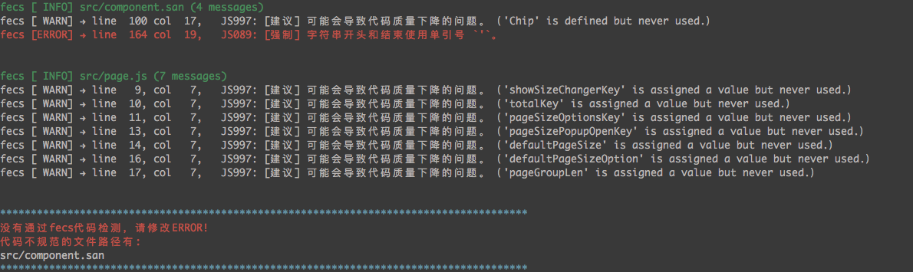

## efe-lint: Yet another fecs

efe-lint是一款代码规范检测工具，基于fecs, 在fecs的基础上，支持了渐进式检测。

## install

```bash
npm install -g efe-lint
```

## how to use

`efe-lint [-p | --progressive] [path]`

最简单的，进入一个项目，运行`efe-lint`命令：

```bash
cd your-project
efe-lint
```

`efe-lint`默认会对当前目录下所有html/css/js/.san文件进行代码规范检测，并有如下的输出结果：



`efe-lint`会在控制台输出每个被检测文件的规范信息，如果被检测文件中有错误，还会在最后集中打印出错的文件路径列表。

或者，也可以指定文件夹或者文件进行检测：

```bash
efe-lint ./src/demo.js
efe-lint ./src/
```

此外还提供了渐进式支持。所谓渐进式，就是配合git对比上次的提交，只检测相比于上次commit有过修改的文件：

```bash
efe-lint -p
# 或者
efe-lint --progressive
```

这样，就会自动对比上次commit之后修改了哪些文件，并进行规范检测。

## 配合pre-commit构建工程流，提升开发规范程度

由于`efe-lint`对渐进式的支持，使得其非常适合配合git hooks进行commit前的代码检测，提升团队工程项目编码规范程度。

推荐配合`pre-commit`实现代码自动检测。只需要安装`efe-lint`和`pre-commit`，然后在`package.json`中增加如下配置：

```json
  "scripts": {
      "efe-lint": "efe-lint -p"
  },
  "pre-commit": {
      "efe-lint"
  }
```
